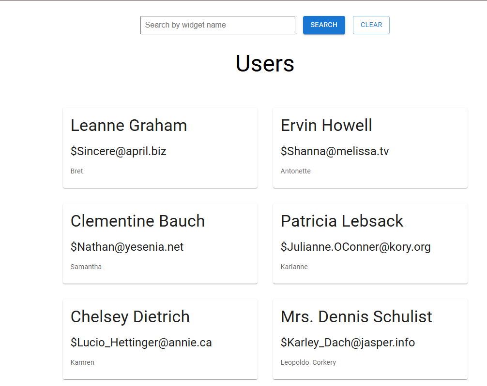
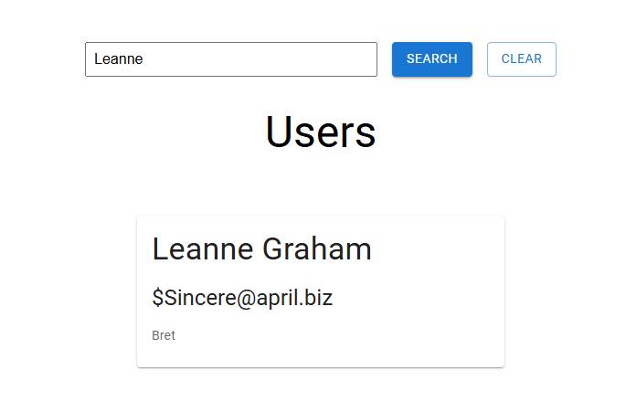

# React UI for the Widget App

## Requirements

Node 20 -- Node can be acquired using [Node Version Manager](https://github.com/nvm-sh/nvm)

## Running the Application

As mentioned in the requirements, this project requires Node v20.19.2 which can be installed using nvm.

Follow the steps below -

Do 

npm install 

npm start (for starting the development server) 

Or, if you want to create and run the production build, do the following -

npm run build 

npm install -g serve 

serve -s build 

## Screenshots

## Notes
* I have focussed on achieving the core functionality of operations for Users and not much on the styling. I have just followed the MUI theme.